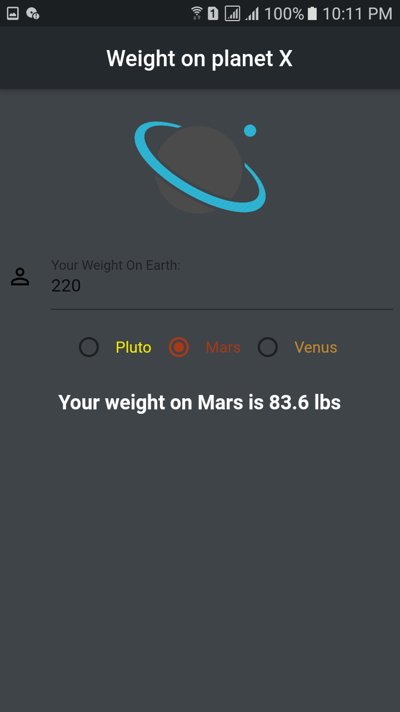

# payment_ui_challenge
 
 - secreenshot for house loan monthly payment ui with functional app.
 
  

- secreenshot for bmi calculator ui with functional app.

   

- secreenshot for login ui with functional app.

  

- secreenshot for planet age calculator ui with functional app.

  

- secreenshot for make rich calculator ui with functional app.

   
